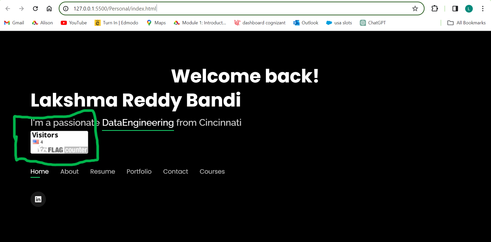
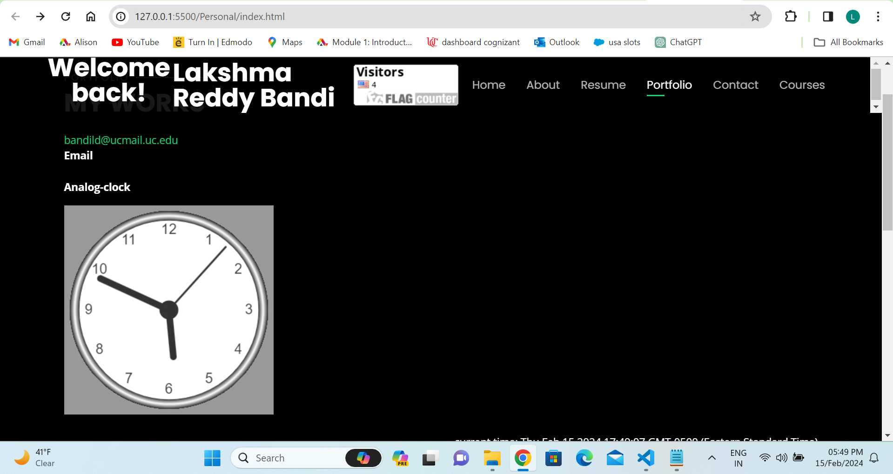
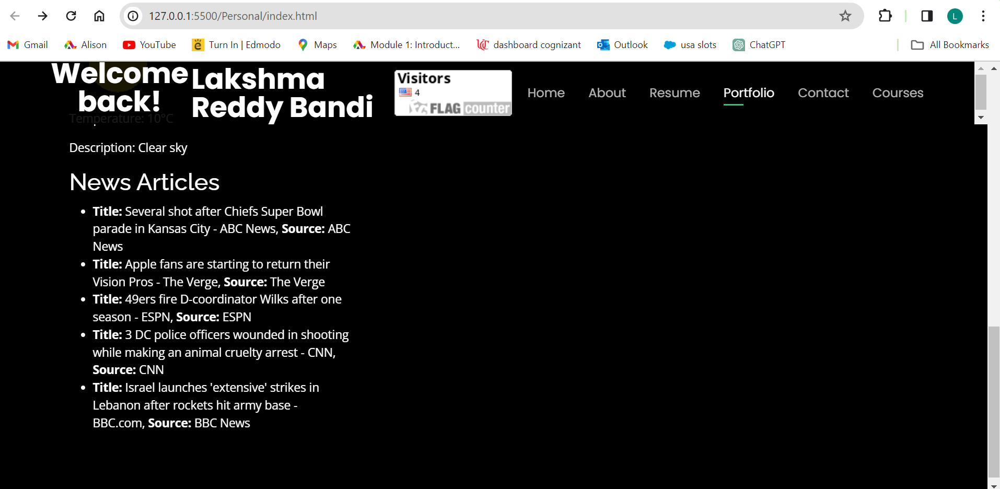
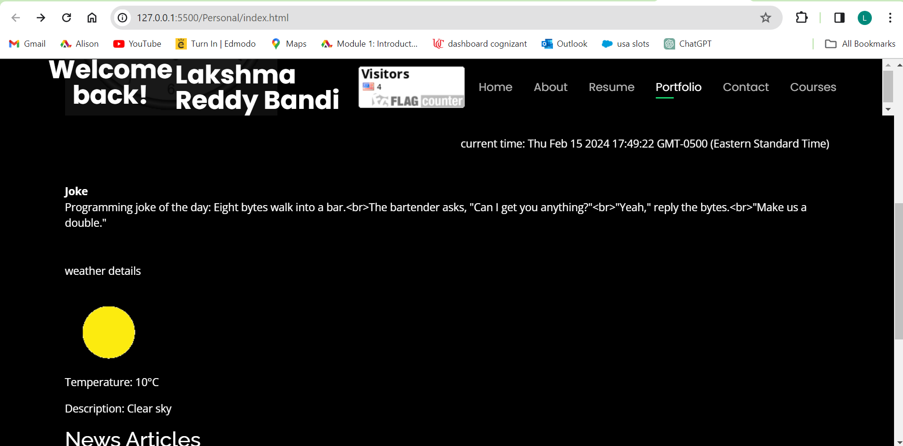
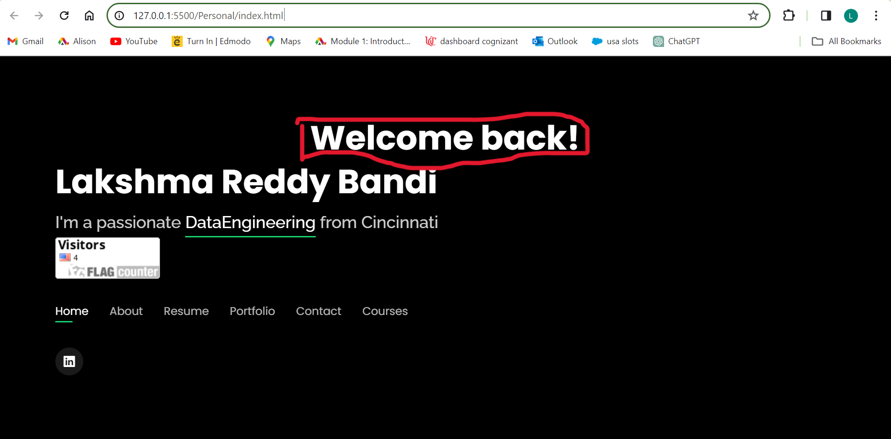

# WAPH-Web Application Programming and Hacking

## Instructor: Dr. Phu Phung

**Name**: LakshmaReddy Bandi

**Email**: bandild@mail.uc.edu

**Short-bio**: Iam Lakshma Reddy Bandi, I am an experienced data engineer, intrested in solving problems in any kind of pressuristic circumstances. Willing to work in an environment that motivates me to become successful in carrer.    


## Repository Information

Respository's URL: [https://github.com/bandild/bandild.github.io](https://github.com/bandild/bandild.github.io)

I   created a private repository to store all course code, organized according to the following structure.

# Individual Project 1 – Front-end Web Development with a Professional Profile Website on github.io cloud service

## Overview and Requirements 

I created a professional profile website for Individual Project 1, showcasing my resume, skills, and experiences. It integrated technical functionalities like joke API, digital clock, email ID, weather API, and Page tracker .

The link to access Individual Project-1 is: [https://github.com/bandild/bandild.github.io](https://github.com/bandild/bandild.github.io).

## General Requirements

### Personal Website on Github.io

The link to access my website is: [https://bandild.github.io/project/index.html](https://bandild.github.io/project/index.html)


\pagebreak

### "Web Application Programming and Hacking" course and related hands-on projects on waph.html file

I created a separate syllabus.html page on my repository, introducing the "Web Application Programming and Hacking" course  . In this html file contains overview of the course. 

The link to access waph.html is: [https://sheelada.github.io/waph.html](https://sheelada.github.io/waph.html).

This page link is accessible from the personal website as shown in below screenshot:


\pagebreak

## Non-technical requirements

### Bootstrap Template

I downloaded a bootstrap template from https://bootstrapmade.com/ and adjusted it according to my professor's requirements and tasks.
### Page Tracker

I had included the page tracker `https://flagcounter.com/`. It is useful to give insights on page views .

page tracker code:

```html
<div id="flag">
        <a href="https://info.flagcounter.com/XCdv"></a>
      </div>
```



\pagebreak


## Technical requirements

### A digital clock; An analog clock; show/hide your email:

In lab 2, a digital and analog clock using JavaScript were implemented, with functionality to display and hide email addresses based on user interaction.

Source Code for digital clock:
```JS
<div id="digital-clock" style="float:right;">
      <b>Digital-clock</b>
      <script>
        function displayTime(){
          document.getElementById('digital-clock').innerHTML="current time: " + new Date();
        }
        setInterval(displayTime,500);
        function validateInput(inputId){
          var input=document.getElementById(inputId).value;
          if(input.length==0){
            alert("please enter the data");
            return false;
          }
          return true;
          }
        </script></div>
```

Source Code for Analog clock:
```JS
<div id="analog">
      <b><p>Analog-clock</p></b>
      <canvas id="analog-clock" width="300%" height="300%" style="background-color:#999"></canvas>
      <script src="https://waph-uc.github.io/clock.js"></script>
      <script>
        var canvas = document.getElementById("analog-clock");
        var ctx=canvas.getContext("2d");
        var radius=canvas.height/2;
        ctx.translate(radius,radius);
        radius=radius*0.90;
        setInterval(drawClock,1000);
        function drawClock() {
        drawFace(ctx,radius);
        drawNumbers(ctx,radius);
        drawTime(ctx,radius);
        }
      </script>
    </div>
```

Source Code for show/hide your email:

```JS
<div id='email' onclick="showhideEmail()">Show my email</div>
      <b>Email</b>
      <script>
        var shown=false;
        function showhideEmail(){
        if(shown){
          document.getElementById('email').innerHTML="Show my email";
          shown=false;
        }
        else{
          var myemail="<a href= mailto:bandild" + "@" + "ucmail.uc.edu>bandild" + "@" + "ucmail.uc.edu</a>";
          document.getElementById('email').innerHTML=myemail;
          shown=true;
          }
        }
      </script>
```

Screenshot Showing Digital clock, Analog Clock, Show/hide your email:



\pagebreak


### One more Functionality of my choice

I had included the Newsapi .It displays the 5 articles in US. 

Source code for Haacker news Api:
```JS
<script src="https://unpkg.com/react@17/umd/react.development.js"></script>
<script src="https://unpkg.com/react-dom@17/umd/react-dom.development.js"></script>
<!-- Babel CDN (for JSX) -->
<script src="https://unpkg.com/@babel/standalone/babel.min.js"></script>
<!-- Axios CDN -->
<script src="https://cdn.jsdelivr.net/npm/axios/dist/axios.min.js"></script>
```
 ```JS
<script type="text/babel">
    const { useState, useEffect } = React;

    function NewsArticles() {
      const [articles, setArticles] = useState([]);

      useEffect(() => {
        fetchNewsArticles();
      }, []);

      const fetchNewsArticles = async () => {
        try {
          const response = await axios.get('https://newsapi.org/v2/top-headlines?country=us&apiKey=620290151bbd416ebd26e7c8aeb50a54');
          setArticles(response.data.articles.slice(0, 5));
        } catch (error) {
          console.error('Error fetching news articles:', error);
        }
      };

      return (
        <div>
          <h2>News Articles</h2>
          <ul>
            {articles.map((article, index) => (
              <li key={index}>
                <strong>Title:</strong> {article.title}, <strong>Source:</strong> {article.source.name}
              </li>
            ))}
          </ul>
        </div>
      );
    }

    ReactDOM.render(<NewsArticles />, document.getElementById('root'));
  </script>
 ```


\pagebreak

### Joke API

The jokeAPI has been integrated to automatically fetch a new joke every minute and display it on the website.

Source code for Joke API:

```JS
<script>
        function encodeInput(input){
		        const encodeData=document.createElement('div');
		        encodeData.innerText=input;
		        return encodeData.innerHTML;
	        }
        function printResult(result){
		        $("#response").html(encodeInput(result));
	        }
	      function newJoke(){
          $.get("https://v2.jokeapi.dev/joke/Programming?type=single",function(result){
		      if(result && result.joke){
			      var encodeJoke=encodeInput(result.joke);
		        $("#response").text("Programming joke of the day: "+ encodeJoke);
		      }
		      else{
			        $("#response").text("could not get the joke");
		      }

	      });}
        newJoke();
        setInterval(newJoke,60000);

  </script>
```

### Weather API

The Weatherbit API has been integrated to retrieve and display current weather 

```JS

<div class="weather">
          <p>weather details</p>
      <div id="weather-info">
        <!-- Weather icon will be displayed here -->
        
        <div id="weather-details"></div>
      </div>
      <script>
        $(document).ready(function () {
            var apiKey = '1ed5f6ac27804a8f9f43abe2bb2684a3'; // Replace 'YOUR_API_KEY' with your actual API key from Weatherbit

            // Make a GET request to Weatherbit API for current weather data
            $.get("https://api.weatherbit.io/v2.0/current", {
                key: apiKey,
                city: 'Cincinnati' // Example city, you can change it to any city you want
            })
                .done(function (data) {
                    // Check if the request was successful and data is available
                    if (data && data.data && data.data.length > 0) {
                        var weatherData = data.data[0];
                        var temperature = weatherData.temp;
                        var description = weatherData.weather.description;
                        var iconCode = weatherData.weather.icon;

                        // Construct the URL for the weather icon
                        var iconUrl = "https://www.weatherbit.io/static/img/icons/" + iconCode + ".png";

                        // Display weather information on the webpage
                        $("#weather-icon").attr("src", iconUrl);
                        $("#weather-details").html("<p>Temperature: " + temperature + "°C</p>" +
                            "<p>Description: " + description + "</p>");
                    } else {
                        $("#weather-info").html("<p>Unable to fetch weather data.</p>");
                    }
                })
                .fail(function () {
                    $("#weather-info").html("<p>Error occurred while fetching weather data.</p>");
                });
        });
      </script>
        </div>

```



\pagebreak

### Javascript Cookies

JavaScript cookies are used to remember client visits and display personalized messages based on their visit history, indicating whether the client is a first-time visitor or a returning user.

```JS
<script>
      function setCookie(name, value, days) {
              var expires = "";
              if (days) {
                  var date = new Date();
                  date.setTime(date.getTime() + (days * 24 * 60 * 60 * 1000));
                  expires = "; expires=" + date.toUTCString();
              }
              document.cookie = name + "=" + value + expires + "; path=/";
          }
  
          // Function to get the value of a cookie by name
          function getCookie(name) {
              var nameEQ = name + "=";
              var cookies = document.cookie.split(';');
              for (var i = 0; i < cookies.length; i++) {
                  var cookie = cookies[i];
                  while (cookie.charAt(0) === ' ') {
                      cookie = cookie.substring(1, cookie.length);
                  }
                  if (cookie.indexOf(nameEQ) === 0) {
                      return cookie.substring(nameEQ.length, cookie.length);
                  }
              }
              return null;
          }
  
          // Function to display the appropriate message based on the cookie
          function displayWelcomeMessage() {
              var visited = getCookie("visited");
              if (visited) {
                  document.getElementById("welcome-message").innerHTML = "<p>Welcome back!</p>";
              } else {
                  document.getElementById("welcome-message").innerHTML = "<p>Welcome!</p>";
                  // Set a cookie with the name "visited" that expires in 30 days
                  setCookie("visited", "true", 30);
              }
          }
  
          // Call the function to display the welcome message
          displayWelcomeMessage();
  </script>
```



